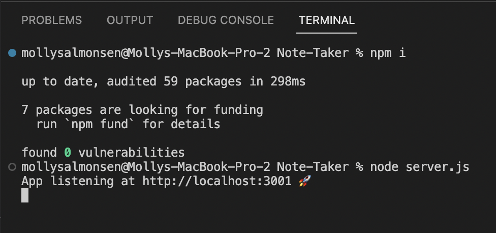
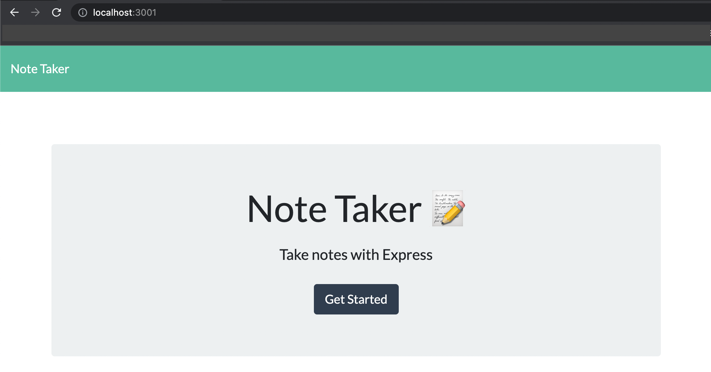

# Note-Taker
Module 11 - Express.js: Note Taker

## Description
The goal of this assignment was to create a Note Taking application that can write & save notes. It uses Express.js in the back end & it needs to save & retrieve note data from a JSON file. 

The application’s front end was already created. The goal of this assignment was to build the back end & connect the two.

User Story: 
```
AS A small business owner
I WANT to be able to write and save notes
SO THAT I can organize my thoughts and keep track of tasks I need to complete
```

## Contents
- [Note-Taker](#note-taker)
  - [Description](#description)
  - [Contents](#contents)
  - [Installation](#installation)
  - [Usage](#usage)
  - [Resources/Credit](#resourcescredit)
  - [Features](#features)
  - [Video](#video)

## Installation
Within the intergrated terminal:
```
npm install 
```

## Usage
Once everything is installed, users can start the application by typing the following in the intergrated terminal:
```md
node server.js
```
This is how the code should look in the intergrated terminal:


This is how the application should look in the web browser:


## Resources/Credit
* Starter Code Provided by UofM Bootcamp 
* Instructors, TAs, & LAs at UofM Bootcamp
* Geeks for Geeks: https://www.geeksforgeeks.org/how-to-build-note-taking-application-using-node-js/ 
* Geeks for Geeks: https://www.geeksforgeeks.org/how-to-read-and-write-json-file-using-node-js/ 
* Medium.com Blog: https://medium.com/@nnamani.ezinne/simple-note-taking-app-using-node-js-and-ejs-4899321a3342 
* David Hybner: https://github.com/WixkedLuck 

## Features
* Node.js
* Express.js
* Javascript

## Video
